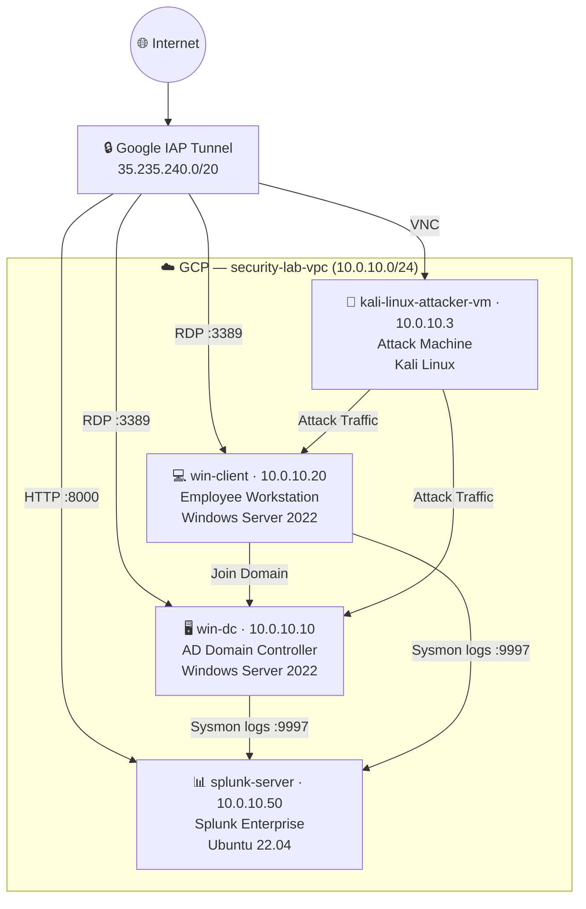
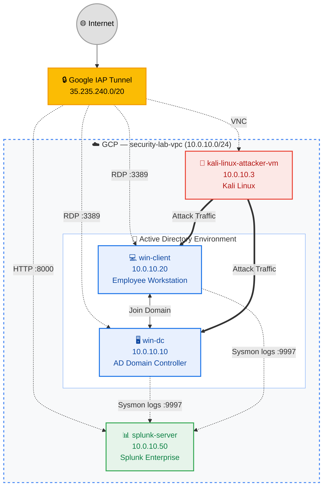

# 🛡️ Splunk Threat Detection Lab

A home lab built on GCP to simulate real attacks and practice threat detection using Splunk SIEM.

---

## 🖥️ Lab Architecture



All machines are in a private VPC (`security-lab-vpc`) with no public exposure.  
Access is via **Google IAP Tunnel** only.

---

## ⚙️ Tech Stack

| Component | Tool |
|---|---|
| Cloud | Google Cloud Platform (GCP) |
| SIEM | Splunk Enterprise |
| Log Collection | Sysmon + Splunk Universal Forwarder |
| AD Environment | Windows Server 2022 Active Directory |
| Attack Machine | Kali Linux (GUI via VNC) |
| Secure Access | Google Identity-Aware Proxy (IAP) |

---

## 📁 Repo Structure

```
├── docs/setup/          # Step-by-step lab setup guides
├── attacks/             # Attack scenarios (commands + screenshots)
├── detection/           # Splunk SPL queries and alert rules
├── scripts/             # Helper scripts (VM recovery, etc.)
└── assets/              # Architecture diagrams
```

---

## 🔴 Attack Scenarios (Coming Soon)

| # | Scenario | MITRE Technique | Status |
|---|---|---|---|
| 01 | Credential Dumping (Mimikatz) | T1003 | 🔜 |
| 02 | Pass-the-Hash Lateral Movement | T1550.002 | 🔜 |
| 03 | Persistence via Scheduled Task | T1053.005 | 🔜 |
| 04 | C2 Beacon Simulation | T1071 | 🔜 |
| 05 | Brute Force RDP | T1110.001 | 🔜 |

---

## 🔵 Detection (Coming Soon)

Each attack will have a matching Splunk SPL query and alert rule documented in `detection/`.

---

## 🚀 Setup

See [`docs/setup/`](docs/setup/) for full step-by-step instructions.

**Quick overview:**
1. Create VPC + firewall rules (IAP + internal traffic)
2. Spin up 4 VMs (win-dc, win-client, splunk-server, kali-attacker)
3. Install Splunk on Ubuntu, configure port 9997 receiver
4. Promote win-dc to AD Domain Controller (`200teamok.local`)
5. Join win-client to domain
6. Install Sysmon + Splunk Universal Forwarder on both Windows VMs
7. Snapshot all VMs as clean baseline images

---

## 🔄 VM Recovery

One-command restore to clean baseline:

```bash
# Restore win-client
gcloud compute instances delete win-client --zone=asia-southeast1-a --quiet && \
gcloud compute instances create win-client --source-machine-image=winclient-clean --zone=asia-southeast1-a
```

See [`scripts/recovery/`](scripts/recovery/) for all VMs.

---

## ⚠️ Disclaimer

This lab is for **educational purposes only**.  
All credentials shown in setup docs are lab-only and should never be used in production.

---


## 📜 Author

**Jeremy Lim**  
Cybersecurity Enthusiast | SOC Analyst (aspiring)  
[LinkedIn](https://www.linkedin.com/in/jeremy-lzh/) · [GitHub](https://github.com/z1r0h)
