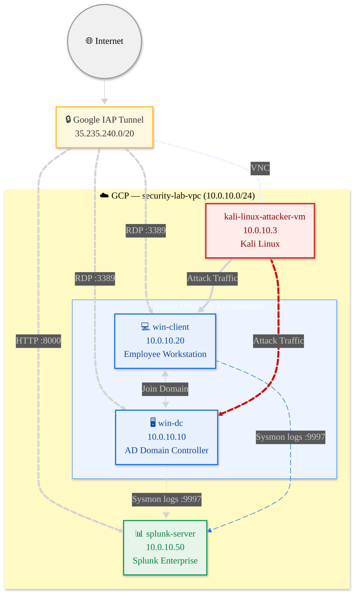

# 🛡️ Splunk Threat Detection Lab
 
A hands-on adversarial simulation lab built on GCP to practice threat detection, log analysis, and SOC workflows using Splunk SIEM and a real Active Directory environment.
 
---
 
## 🎯 Purpose
 
This lab was built to bridge the gap between certification knowledge and real-world SOC work.
 
**What this lab practices:**
- Simulating real attacker techniques using Kali Linux (MITRE ATT&CK mapped)
- Writing custom Splunk SPL detection rules from scratch
- Understanding how logs flow from endpoint → forwarder → SIEM → alert
- Investigating alerts the same way a SOC Analyst would on the job

**What this lab demonstrates:**
- Hands-on experience with Sysmon telemetry and Windows Event Logs
- Detection engineering — not just consuming alerts, but building them
- Active Directory attack surface awareness (credential abuse, lateral movement, persistence)
- Documentation discipline — every attack scenario recorded with commands, SPL, and findings
> This lab is intentionally kept close to entry-level SOC reality: Sysmon-based endpoint detection without a firewall or IDS, reflecting what many organisations actually rely on. Limitations are documented honestly in each attack scenario.
 

---

## 🖥️ Lab Architecture



All machines are in a private VPC (`security-lab-vpc`) with no public exposure.  
Access is via **Google IAP Tunnel** only.

Created by [Mermaid Live Editor](https://mermaid.ai/)

---

## ⚙️ Tech Stack

| Component | Tool |
|---|---|
| Cloud | Google Cloud Platform (GCP) |
| SIEM | Splunk Enterprise |
| Log Collection | Sysmon + Splunk Universal Forwarder |
| AD Environment | Windows Server 2022 Active Directory |
| Attack Machine | Kali Linux (GUI via VNC) |
| Secure Access | Google Identity-Aware Proxy (IAP) |

---

## 📁 Repo Structure

```
├── docs/setup/          # Step-by-step lab setup guides
├── attacks/             # Attack scenarios (commands + screenshots)
├── detection/           # Splunk SPL queries and alert rules
├── scripts/             # Helper scripts (VM recovery, etc.)
```

---

## 🔧 Splunk Apps
 
Four apps are installed on `splunk-server`. Install in this exact order:
 
| # | App | Splunkbase | Role |
|---|---|---|---|
| 1 | **Splunk Add-on for Sysmon** | [ID 5709](https://splunkbase.splunk.com/app/5709) | Parses Sysmon XML into searchable fields |
| 2 | **Splunk Add-on for Microsoft Windows** | [ID 742](https://splunkbase.splunk.com/app/742) | Parses native Windows Event Log fields |
| 3 | **Splunk Security Essentials** | [ID 3435](https://splunkbase.splunk.com/app/3435) | SPL reference library + MITRE-mapped detection templates |
| 4 | **MITRE ATT&CK App for Splunk** | [ID 4617](https://splunkbase.splunk.com/app/4617) | Visual ATT&CK matrix heatmap |
 
### How they work together
 
```
Sysmon + Windows Event Logs (win-dc, win-client)
    │  Forwarded via Splunk Universal Forwarder → port 9997
    ▼
TA for Sysmon (5709) + TA for Windows (742)
    │  Parse raw XML into searchable CIM fields
    │  e.g. EventCode, SourceIp, DestinationPort, CommandLine, Image
    │
    │  ⚠️ Note: sourcetype is normalised to xmlwineventlog (lowercase)
    │  by TA for Windows — this is expected behaviour, not a bug
    ▼
Custom SPL Alerts (hand-written per attack scenario)
    │  e.g. EventCode=3 + dc(DestinationPort) > 20 → Port Scan
    │  All alerts manually built and saved in Splunk
    ▼
MITRE ATT&CK App (4617)
    │  Maps alert hits onto the ATT&CK matrix
    ▼
ATT&CK Matrix Dashboard
    Technique cells light up based on your triggered alerts
```
 
### Important: alerts are not automatic
 
None of these apps auto-generate alerts out of the box. Security Essentials is a **reference library** — all 900+ rules are disabled by default and most require additional datamodel configuration. 
 
All detection alerts in this lab are **hand-written SPL queries** saved as Splunk alerts. This is intentional — writing detections from scratch is better preparation for SOC work than enabling pre-built rules.
 
See [`detection/`](detection/) for all SPL queries used in this lab.
 
### App details
 
**Splunk Add-on for Sysmon (5709)** — Install first  
Translates raw Sysmon XML into CIM-standard field names. Without this, Sysmon logs arrive as unparsed XML and fields like `SourceIp`, `CommandLine`, `Image` are not searchable.
 
> ⚠️ The old Sysmon App (ID 3544) is archived — do not use it. Use 5709 instead.
 
**Splunk Add-on for Microsoft Windows (742)** — Install second  
Required alongside 5709. Enables correct parsing of native Windows Event Log fields (EventCode 4625, 4720, 4698, etc.) and provides the XML processing framework that Sysmon TA depends on.
 
**Splunk Security Essentials (3435)** — SPL reference  
A library of 900+ detection templates mapped to MITRE ATT&CK. Use it to understand how detections are structured, what data sources they need, and how to write your own SPL. Not an auto-alerting system.
 
**MITRE ATT&CK App for Splunk (4617)** — Install last  
Renders a live ATT&CK matrix heatmap. After a port scan alert fires, T1046 (Network Service Discovery) lights up under the Discovery tactic. Clicking any cell links directly to `attack.mitre.org`.
 
---

## 🔴 Attack Scenarios (Coming Soon)

| # | Scenario | MITRE Technique | Status |
|---|---|---|---|
| 01 | Credential Dumping (Mimikatz) | T1003 | 🔜 |
| 02 | Pass-the-Hash Lateral Movement | T1550.002 | 🔜 |
| 03 | Persistence via Scheduled Task | T1053.005 | 🔜 |
| 04 | C2 Beacon Simulation | T1071 | 🔜 |
| 05 | Brute Force RDP | T1110.001 | 🔜 |

---

## 🔵 Detection (Coming Soon)

Each attack scenario has a matching Splunk SPL query and alert rule documented in [`detection/`](detection/).
 
Detection flow for every scenario:
1. Run attack from `kali-linux-attacker-vm`
2. Sysmon captures event on victim VM
3. Splunk Universal Forwarder sends log to `splunk-server`
4. Security Essentials rule fires and creates alert
5. MITRE ATT&CK App matrix highlights the technique

---

## 🚀 Setup

See [`docs/setup/`](docs/setup/) for full step-by-step instructions.

**Quick overview:**
1. Create VPC + firewall rules (IAP + internal traffic)
2. Spin up 4 VMs (win-dc, win-client, splunk-server, kali-attacker)
3. Install Splunk on Ubuntu, configure port 9997 receiver
4. Promote win-dc to AD Domain Controller (`200teamok.local`)
5. Join win-client to domain
6. Install Sysmon + Splunk Universal Forwarder on both Windows VMs
7. Snapshot all VMs as clean baseline images

---

## 🔄 VM Recovery

One-command restore to clean baseline:

```bash
# Restore win-client
gcloud compute instances delete win-client --zone=asia-southeast1-a --quiet && \
gcloud compute instances create win-client --source-machine-image=winclient-clean --zone=asia-southeast1-a
```

See [`scripts/recovery/`](scripts/recovery/) for all VMs.

---

## ⚠️ Disclaimer

This lab is for **educational purposes only**.  
All credentials shown in setup docs are lab-only and should never be used in production.

---


## 📜 Author

**Jeremy Lim**  
Cybersecurity Enthusiast | SOC Analyst (aspiring)  
[LinkedIn](https://www.linkedin.com/in/jeremy-lzh/) · [GitHub](https://github.com/z1r0h)
